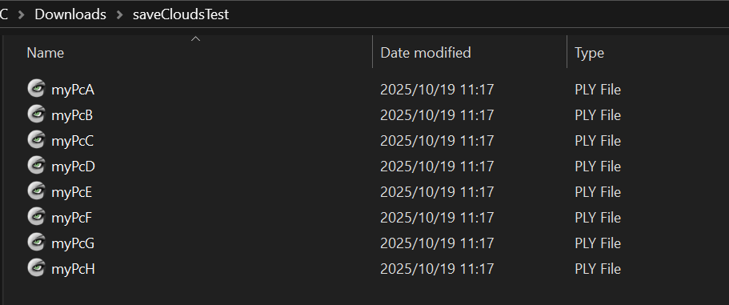
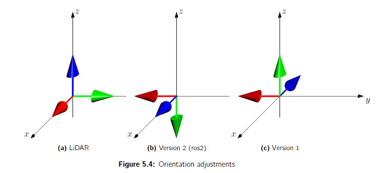
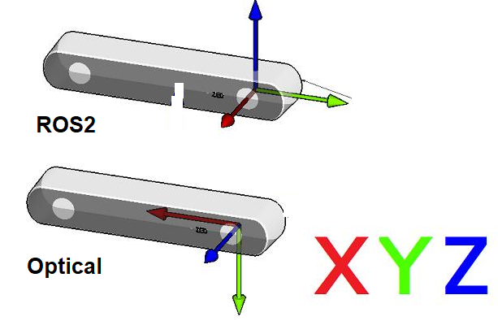

# User Guide


[https://www.mathworks.com/help/vision/point-cloud-processing.html](https://www.mathworks.com/help/vision/point-cloud-processing.html)


# ExtractClouds

```matlab:Code
addpath("C:\Users\agori\Documents\MATLAB\3D-Sea-Ice\ExtractClouds");
```

## Reading Clouds
## `pcread`
## `Reading a .ply file to a pointCloud object`


[`ptCloud`](https://www.mathworks.com/help/vision/ref/pcread.html#buphpf3-1-ptCloud)` ``= pcread(`[`filename`](https://www.mathworks.com/help/vision/ref/pcread.html#buphpf3-1-filename)`)` reads a point cloud from the PLY or PCD file specified by the input `filename`. The function returns a [`pointCloud`](https://www.mathworks.com/help/vision/ref/pointcloud.html) object, `ptCloud`.


```matlab:Code
myPc=pcread("RS_Pancake3\Pancake3-A.ply");
```


**`[arrClouds] = readCloudsPlyGeneral(pathname)`**


Description: Reads all .ply files in the directory and saves them as an array of pointCloud objects stored in arrClouds


```matlab:Code
myClouds=readCloudsPlyGeneral('RS_Pancake3\');
```


```text:Output
myClouds = 
  1x8 pointCloud array with properties:

    Location
    Count
    XLimits
    YLimits
    ZLimits
    Color
    Normal
    Intensity

```

## Displaying Clouds


**`pcshow`**


```matlab:Code
pcshow(myPc);
```


**`pcDisplay`**


Description: overwriting of `pcshow `with axes labels/formatting 


```matlab:Code
pcDisplay(myPc);
```


**`pcDisplayPair`**


Description: similar to pcDisplay, overwriting of `pcshowpair` with formatting. Displays 2 clouds in different colours: one in green and one in purple


```matlab:Code
pcDisplayPair(myClouds(1), myClouds(2));
```


**`pcDisplayClouds`**


Description: displays a pointCloud array in different colours for a maximum of 10 pointClouds in the array


```matlab:Code
pcDisplayClouds(myClouds);
```


**Alternative to pcDisplayClouds: ****`pccat + pcDisplay`**


Description: to display the array merged together use the function **`pccat`** which concatenates the pointClouds into a single pointCloud, then use **`pcDisplay`**


```matlab:Code
allPnts=pccat(myClouds);
pcDisplay(allPnts);
```


  
## Writing/exporting Clouds


**`pcwrite`**


```matlab:Code
pcwrite(myPc,"myPc.ply");
```


**`saveClouds(arrClouds,exportPath, fname)`**


Description: saves each pointCloud element in arrClouds as an individual .ply file located in the exportPath with each entry having the name "fnameX.ply" where X is a letter from A-H depending on its position in in the array eg. arrClouds(1) will be saved as "fnameA.ply" etc.


```matlab:Code
saveClouds(myClouds, "C:\Users\agori\Downloads\saveCloudsTest\","myPc");
```


Output:





## Transforming Realsense Coordinates
  








As you can see from the above diagrams (and from previous displays), the Intel Realsense has different way of recording their coordinates so to make it align with my LiDAR readings, a transformation needs to be applied so it matches the LiDAR scans/common practice of Z being upwards instead of forward. 


**Constructing matrix transformation:**


Note: the exact transform may be different for a different model/data capture method. Below is for the Intel Realsense D455 using the Realsense Viewer. For ROS2 implementation this is slightly diffferent: always check with your point cloud and adjust to what makes sense for the application.


```matlab:Code
C_RL = [0, 0, -1, 0;
        -1, 0, 0, 0;
        0, 1, 0, 0;
        0, 0, 0, 1]; %Represents Intel Realsense Viewer transform using D455

C_LR = C_RL';  

axesTform=rigidtform3d(C_RL);
```


**Applying transform to a single pointCloud**


```matlab:Code
myPcUpdated=pctransform(myPc,axesTform);
pcDisplay(myPcUpdated);
```


**Applying transform to array of pointClouds**


```matlab:Code
myCloudsUpdated=myClouds;
for k=1:length(myClouds)
    myCloudsUpdated(k)=pctransform(myClouds(k),axesTform);
end
```

## **Cropping Clouds**


You can manually show the effect of different cropping by changing zlim,ylim an xlim. This gives a good manual cropping. Following this, the crop can be applied to the pointCloud so you aren't working with unnecessary points.


**Test code:**


```matlab:Code
pcDisplay(myPcUpdated);
z_roi=[-inf,1];
y_roi=[-2,2];
x_roi=[1,inf];

roi=[x_roi,y_roi,z_roi];
zlim(z_roi);
ylim(y_roi);
xlim(x_roi);
```


**`[pcCropped,roi] = cropCloud(pcloud,xcrop,ycrop,zcrop)`**


Description: cropping a single pointCloud


```matlab:Code
myPcCropped=cropCloud(myPcUpdated,x_roi,y_roi,z_roi);
pcDisplay(myPcCropped);
```


**`[arrCloudsCropped] = cropClouds(arrClouds,roi)`**


Description: cropping a array of pointCloud objects


```matlab:Code
myCloudsCropped=cropClouds(myCloudsUpdated,roi);
pcDisplayClouds(myCloudsCropped);
```


Other cropping functions


**`[croppedPtCloud] = cropBrushed(brushedXYZ,ptCloud)`**: from the figure you can select points by using a brush functionality and then saving this as brushedXYZ. This function then crops the cloud to only include the brushed data.


LiDAR specific: **`cropMerge`** \& **`cropMergeDownsample`**


**Relevant MATLAB filtering functions:**


Review site for full list of filtering capabilities but I use the gridAverage method mostly:


**`pcdownsample: `**downsamples pointCloud based on a specific gridStep


```matlab:Code
myPcCleaned=pcdownsample(myPcCropped,"gridAverage",0.1);
pcDisplay(myPcCleaned);
```


**`pccat: `**concatenates array of pointClouds into single pointCloud (used in earlier example)


**`pcmerge: `**merges 2 individual pointCloud objects by concatenating them and downsampling (might be useful)


## Aligning floor


**`[pcRotated,tform] = alignFloorTform(ptCloud)`**


Description: performs alignment using pcfitplane, returns the rotated pointCloud and the transformation performed.


Looking deeper into this for modification:


```matlab:Code
ptCloud=myPcUpdated;
maxDistance=0.02; %max distance tolerance from plane
MaxNumTrials=3000; %no. of trials
referenceVector=[0, 0, 1]; %Z direction
[model1,inlierIndices,outlierIndices] = pcfitplane(ptCloud,maxDistance,referenceVector,MaxNumTrials);
[pcRotated, tform] = rotatePlane(ptCloud, model1); %custom function that rotates the cloud to straighten the model
```


**Displaying model:**


```matlab:Code
pcDisplay(ptCloud);
hold on;
plot(model1);
hold off;
```


**Displaying the inliers vs outliers:**


```matlab:Code
pcshow(ptCloud.Location(outlierIndices,:), 'r');
hold on;
pcshow(ptCloud.Location(inlierIndices,:), 'g');
legend('Outliers', 'Plane inliers');
hold off;
```


**Display rotated:**


```matlab:Code
pcDisplay(pcRotated);
```


***TODO**: also align floor to Z=0


# CoarseAlignment
## Matrix method:

   -  **`matrix_alignClouds`** 

## Point-based gluing:

   -  Basic functionality in MATLAB app but **not robust** 
   -  Use MeshLab Align feature instead 
   -  Follow instructions:  
   -  Save project as .aln file 
   -  Read .aln file using **`extractALNtformRigid`** 

# **FineAlignment (GliraICP)**


uses GliraICP


Note: code overwrites pointCloud object so open run this separately and when complete close the app


   -  **`runICPtest`** 
   -  **`runGliraICP(input folder, output folder)`** 
   -  **`saveICPclouds:`** exports to .ply files 
   -  **`graphICPstats`** 
   -  **`readTformFile`** 

# **Data Analysis**

   -  cropping floor 
   -  extractMax 
   -  **`interpolateCloud`** 
   -  surf(X,Y,F) 
   -  std(non-nanF) 
   -  pc2surfaceMesh 

